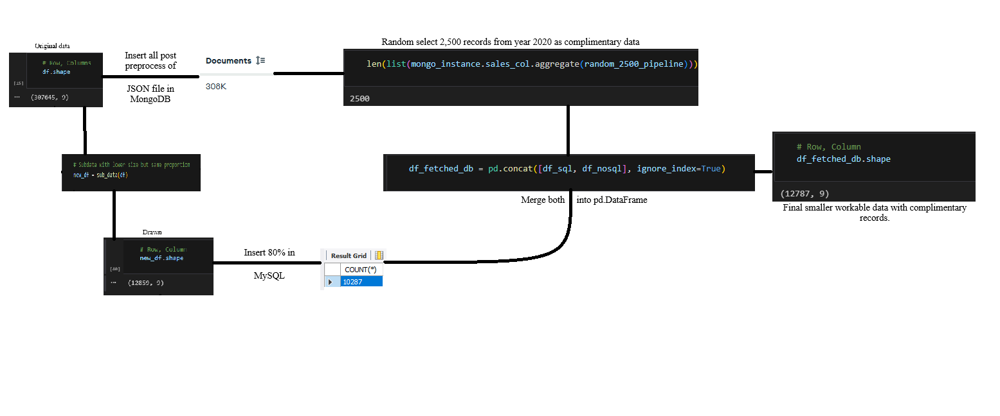
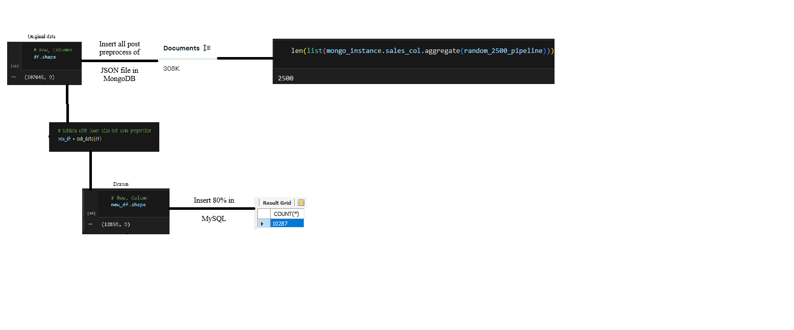
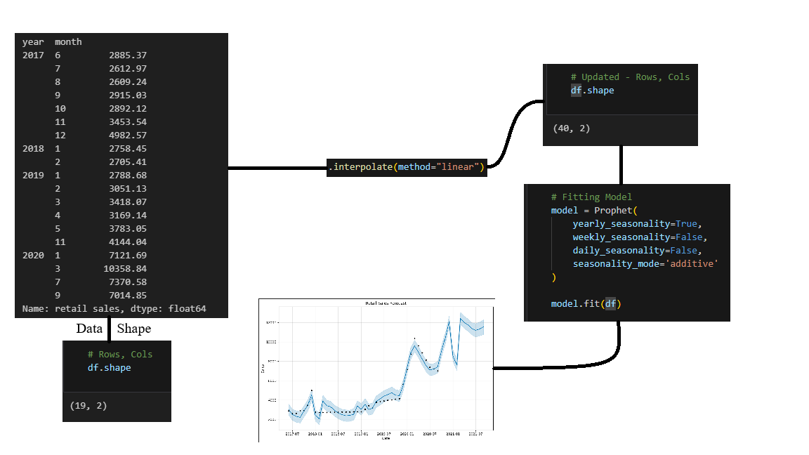
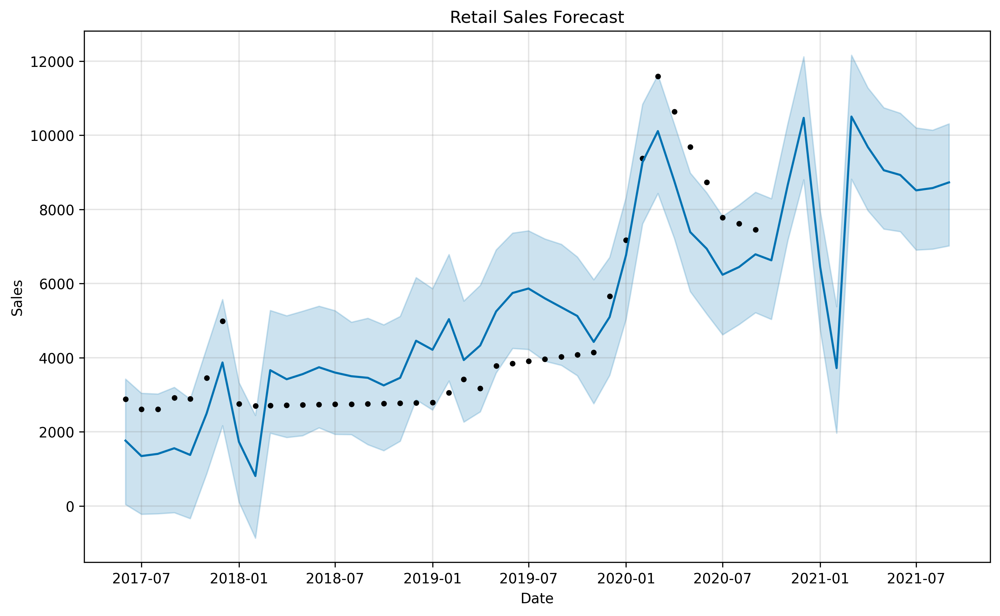
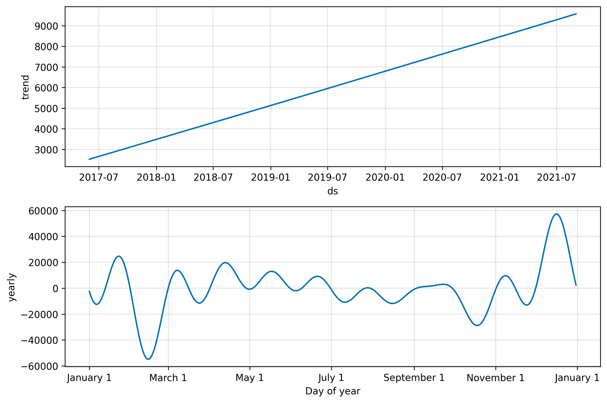
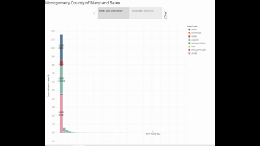

# Montgomery County of Maryland Warehouse & Sales from year 2017 to 2020
This project aims to apply the techniques of data analysis and analytics to draw significant, useful, informative conclusion. 

## Table of Content
- [Libraries Used](#libraries-used)
- [Dataset](#dataset)
- [Time Series Forecasting](#time-series-forecasting)
- [Getting Started](#getting-started)
- [StreamLit App](#streamlit-app)
- [Tableau](#tableau)
- [Future Scope](#future-scope)

## Libraries Used

This project utilizes several Python libraries for data manipulation, visualization, and time series forecasting:
```python
Numpy, Pandas, Matplotlib, Seaborn, Prophet, StreamLit
```

## Dataset


[Data.gov Dataset Link](https://catalog.data.gov/dataset/warehouse-and-retail-sales)

300,000+ record with around a dozen of features of warehouses recorded during year 2017 to 2020 with retail sales, retail transfers, and warehouse sales. Making a multi target problem



## Time Series Forecasting

Meta Prophet model was used to forecast the sales. The sale was summed up month wise for all the 300+ suppliers available in the records. 



The model forecasting is very close to the actual outcomes 

- Forecasting:


- Forecastinng components


## Getting Started

1. Clone the repository using the command below.
```bash
git clone https://github.com/UmerSalimKhan/Mongomery_Sales_2017_2_2020_analysis_and_analytics.git
```

2. Navigate to the project directory.
```bash
cd Mongomery_Sales_2017_2_2020_analysis_and_analytics
```

3. Install the required dependencies as specified in the `requirements.txt` file.
```bash
pip install -r requirements.txt
```

4. Run the application using your preferred method (e.g., Streamlit).
```bash
streamlit run app.py
```

**Note:** Don't forget to download the dataset, run the .ipynb notebook to get the model, and set the paths correctly first. Or else, you will run out into a disappointing error.

## StreamLit App
1. Streamlit app shows the interactive dashboard for the sales and other target.
2. It also contains forecasting for furture one year not mentioned in data with forecasting components. 

## Tableau 


## Future Scope
There can be achieve a lot in this project. 
1. Full dataset for the county can be considered for the whole project to produce more smoothness. ‘
2. Analysis can be done in depth for individual suppliers (300+).
3. Analytics can also be achieved using ARIMA model after confirming stationarity through Augmented Dickey Fuller test and further can be differenced. Furthermore, Auto – Correlation Function and Partial Auto – Correlation function can be used for better result. 
4. Tableau aspect of the project can be enhanced further. 
5. StreamLit aspect of the Project can be continued. 
6. A collaboration with Government can be asked for betterment of the County.

